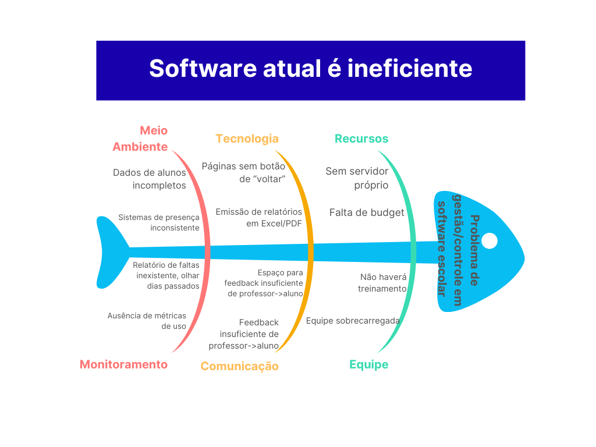

## Introdução ao Negócio e Contexto

O Corpo de Bombeiros Militar do Distrito Federal mantém o <b>Programa Bombeiro Mirim (PBM)</b>, uma iniciativa social voltada para crianças e adolescentes entre 7 e 14 anos, preferencialmente matriculados na rede pública de ensino. O programa é gratuito e funciona nos Grupamentos do CBMDF, oferecendo atividades educativas, esportivas, culturais e recreativas, visando o bem-estar e o desenvolvimento biopsicossocial dos participantes.

Por meio de valores como <b>Educação, Cidadania e Proteção à Vida</b>, o PBM tem como referência o Estatuto da Criança e do Adolescente (ECA, 1990), com a prioridade de execução de políticas públicas que garantam a proteção da infância e juventude, prevenindo negligência, discriminação, violência, exploração e garantindo os direitos fundamentais dos participantes.

O programa está presente em <b>12 cidades do Distrito Federal</b> (Gama, Santa Maria, Recanto das Emas, Samambaia, Núcleo Bandeirante, Cidade Estrutural, Ceilândia, Brazlândia, Sobradinho, Planaltina, Paranoá e São Sebastião), com mais de <b>37 anos de existência</b>, institucionalizado pela Lei nº 2.449 de 24/09/1999.

As atividades incluem: palestras, aulas teóricas, oficinas, atividades culturais e recreativas, sempre com enfoque em ética, cidadania, primeiros socorros, prevenção de acidentes domésticos e trânsito, adaptadas de forma lúdica para a faixa etária atendida.

## Identificação da Oportunidade ou Problema

O software atualmente utilizado para o controle de presença apresenta limitações que comprometem sua eficiência e usabilidade. A análise com o Diagrama de Ishikawa destacou problemas como a ausência de um espaço para justificar faltas dos brigadinos e a navegação limitada, já que algumas páginas não permitem retorno às anteriores.

Também foi identificada a falta de relatórios individuais de presença e de indicadores ou dashboards que facilitem o acompanhamento da frequência e do desempenho dos alunos. A comunicação com pais e responsáveis ocorre de forma fragmentada, geralmente por aplicativos externos, o que dificulta a centralização das informações.

Além disso, o sistema não dispõe de registro estruturado de informações médicas relevantes (como alergias ou asma) nem de um espaço adequado para acompanhamento específico de crianças neurodivergentes, restringindo a personalização do apoio oferecido.

Por fim, identificou-se a inexistência de um espaço dedicado ao acompanhamento específico de crianças neurodivergentes, o que restringe a personalização e a adequação do apoio oferecido a esse público.

<b>Figura 1:</b> Diagrama de Ishikawa (Fishbone) com os principais desafios do projeto.

## Desafios do Projeto

O desenvolvimento do sistema de gestão de presença enfrenta um conjunto de desafios que refletem tanto as limitações do contexto quanto as necessidades específicas do Programa do CBMDF. Esses desafios não se restringem apenas à implementação técnica, mas abrangem também aspectos de engajamento e sustentabilidade do projeto.

Um primeiro obstáculo a ser considerado é a <b>limitação orçamentária</b>, visto que o programa possui caráter social e recebe baixo investimento, o que impacta diretamente a disponibilidade de recursos para infraestrutura. Também se destaca a necessidade de <b>gerar relatórios e análises gráficas consistentes</b> sobre o histórico de presença, garantindo informações claras, precisas e de fácil interpretação tanto para gestores quanto para responsáveis.

Adicionalmente, o projeto deve lidar com questões como:

- Limitação orçamentária, uma vez que, o Programa do CBMDF é um projeto social que recebe baixo investimento. 
- Projetar uma área para comunicação formal entre o programa e os responsáveis que tenha adesão entre os responsáveis.
- Gerar relatórios e análises gráficas sobre o histórico de presença que sejam coesas e precisas.
- Usabilidade e acessibilidade, a fim de atender um público com distintos níveis de familiaridade digital.

Assim, os desafios do projeto não apenas delimitam as dificuldades a serem enfrentadas, mas também orientam decisões estratégicas de planejamento e execução, servindo como referência para a priorização de esforços e o desenho de soluções eficazes.

## Segmentação de Clientes

O público-alvo do sistema são os gestores e professores das 12 unidades do PBM, cada uma com cerca de três docentes responsáveis pelo acompanhamento direto das crianças. Este pública apresenta as seguintes características:

- Faixa etária de 35 a 50 anos.

Os usuários finais indiretos são os pais ou responsáveis, que poderão acessar informações de presença, justificativas, relatórios e comunicação com a equipe. Já os beneficiários diretos são as crianças e adolescentes (7 a 14 anos) que participam do programa, conhecidos como <b>Brigadinos ou Brigadinas</b>.

| Data | Versão | Descrição | Autor(es) | Revisor(es) |
|------|--------|-----------|-----------|-------------|
| 15/09/2025 | 1.0 | Criação inicial do documento de cenário. | Lucas Branco | Todos |